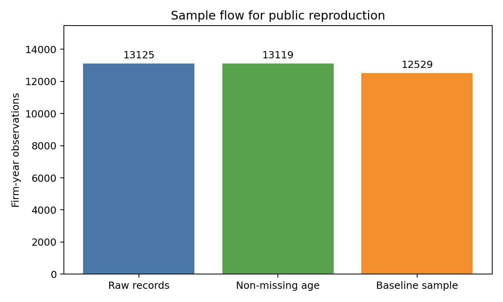
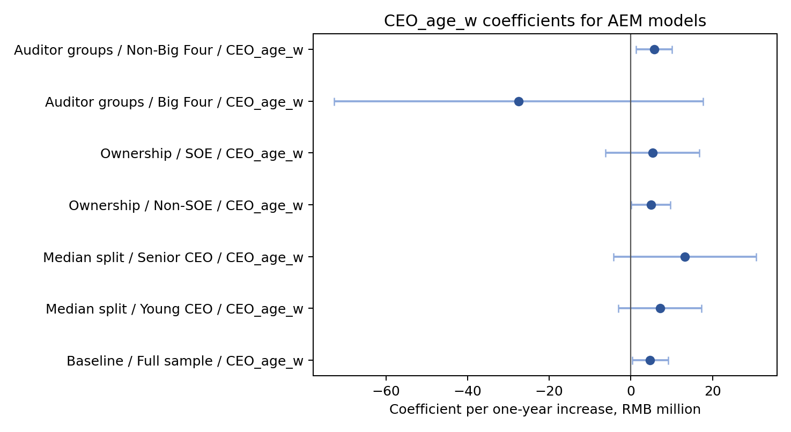
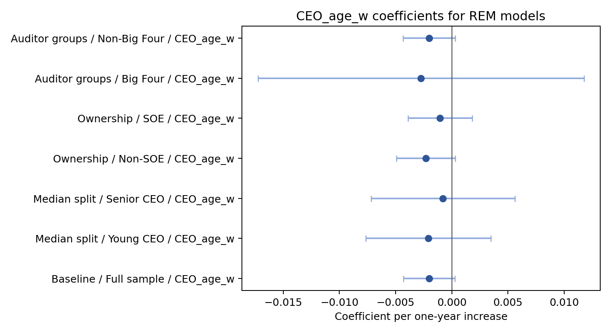

# CEO Age and Earnings Management

This repository is a cleaned and reproducible implementation derived from a team course research project.

The project asks whether CEO age is associated with earnings management among Chinese listed firms. The public repository keeps code, tests, schema documentation, re-estimated summary results, and figures that can be reproduced from a locally supplied licensed dataset.





## Public Sample

The re-estimated baseline sample contains 12,529 firm-year observations from 2,944 Chinese A-share listed firms between 2014 and 2024. The local source file used for validation has 13,125 rows, with 6 missing CEO-age records and 13,119 records available for descriptive age summaries.

## Method

The public models use firm and year fixed effects. The main reported inference uses firm-clustered standard errors. Sensitivity files also report heteroskedastic robust, year-clustered, and firm-year two-way clustered covariance settings.

## Main Re-Estimated Results

In the firm-clustered baseline specification, CEO age is positively associated with the AEM measure: coefficient 4,727,401.705, with p-value 0.0352. The public reconstruction preserves the original AEM variable but does not assign a monetary interpretation where the underlying scale cannot be verified from the available project materials. The association between `CEO_age_w` and `REM` is negative: coefficient -0.0020135, with p-value 0.0861. The REM estimate reaches the 10% level under the main firm-clustered setting, so it should be read as weaker than the AEM result.

## Reproducible Scope

This public version covers data validation, sample construction, baseline AEM and REM regressions, median CEO-age split models, ownership heterogeneity, auditor-group heterogeneity, fixed age-band robustness, covariance sensitivity checks, and public figures.

It does not reproduce or claim validation of IV, 2SLS, causal effects, or OPRISK mechanism results. The original course report included additional analyses whose generation chain could not be locked reliably, so they are excluded from the public claims.

## Repository Structure

- [Source code](src/) contains loading, variable, model, estimation, writing, and plotting modules.
- [Scripts](scripts/) contains task-oriented reproduction and public-summary copy scripts.
- [Tests](tests/) contains public synthetic-data tests and local integration tests.
- [Data notes](data/README.md) and [required schema](data/required_schema.csv) describe the local data contract.
- [Documentation](docs/) covers [methodology](docs/methodology.md), [results](docs/results.md), [reproducibility](docs/reproducibility.md), [limitations](docs/limitations.md), and [license notes](docs/license_note.md).
- [Results](results/) stores public summary CSV files generated by this repository.
- [Figures](figures/) stores public figures generated by this repository.

## Installation

```bash
python -m pip install -r requirements.txt
```

## Local Configuration

Copy `config.example.yaml` to `config.local.yaml`, keep `config.local.yaml` private, and point it to a local licensed data file with the required schema. Relative paths in the config are resolved from the config file directory.

## Run Analysis

```bash
python run_all.py --config config.local.yaml
```

This writes analysis outputs only to the configured `output_dir` and `figure_dir`.

## Copy Public Summaries

After reviewing local outputs, copy the whitelisted summary files and public figures:

```bash
python scripts/copy_public_summaries.py --config config.local.yaml
```

## Tests

Public tests use synthetic data:

```bash
pytest -m "not integration"
```

Local integration tests require the private local dataset:

```bash
pytest -m integration --config config.local.yaml
```

## Data License Boundary

Raw licensed data, company-level records, company names, CEO names, course report files, course slides, and team-member identifiers are not included.

## Team Project Boundary

The source research was a team course project. This repository presents a cleaned reproducible implementation and should not be read as an individual claim of authorship over the entire original report, dataset construction, or presentation.
