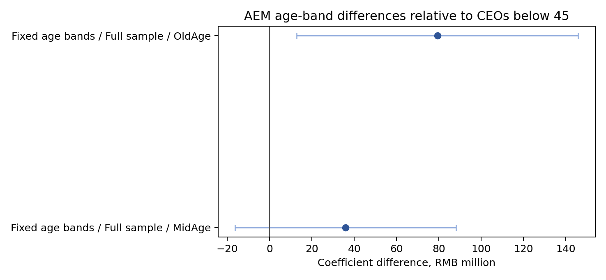
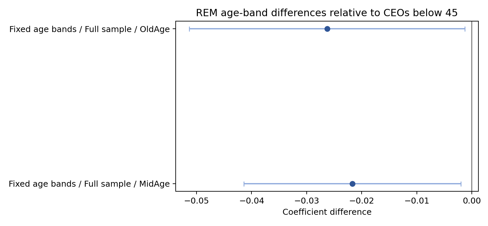

# Results

All tables below use `results/reproduced_primary_results.csv`, generated by the current repository code with firm-clustered standard errors. They are not copied from the course report.

## Baseline Models

| Analysis | Dependent | Core variable | Sample | Coef. | Std. error | p-value | Obs. | Firms | Covariance |
|---|---|---|---|---:|---:|---:|---:|---:|---|
| Baseline | AEM_w | CEO_age_w | Full sample | 4,727,401.705 | 2,244,494.078 | 0.0352 | 12,529 | 2,944 | firm clustered |
| Baseline | REM | CEO_age_w | Full sample | -0.00201351 | 0.00117285 | 0.0861 | 12,529 | 2,944 | firm clustered |

## Median Age Split

| Analysis | Dependent | Core variable | Sample | Coef. | Std. error | p-value | Obs. | Firms | Covariance |
|---|---|---|---|---:|---:|---:|---:|---:|---|
| Median split | AEM_w | CEO_age_w | Young CEO | 7,112,523.684 | 5,173,923.114 | 0.1693 | 5,749 | 1,820 | firm clustered |
| Median split | AEM_w | CEO_age_w | Senior CEO | 13,187,270.381 | 8,909,869.567 | 0.1389 | 6,780 | 1,924 | firm clustered |
| Median split | REM | CEO_age_w | Young CEO | -0.00209027 | 0.00283712 | 0.4613 | 5,749 | 1,820 | firm clustered |
| Median split | REM | CEO_age_w | Senior CEO | -0.000793209 | 0.00326306 | 0.8079 | 6,780 | 1,924 | firm clustered |

## Ownership Groups

| Analysis | Dependent | Core variable | Sample | Coef. | Std. error | p-value | Obs. | Firms | Covariance |
|---|---|---|---|---:|---:|---:|---:|---:|---|
| Ownership | AEM_w | CEO_age_w | Non-SOE | 4,889,577.174 | 2,452,167.251 | 0.0462 | 11,093 | 2,460 | firm clustered |
| Ownership | AEM_w | CEO_age_w | SOE | 5,311,495.696 | 5,869,151.826 | 0.3657 | 1,436 | 484 | firm clustered |
| Ownership | REM | CEO_age_w | Non-SOE | -0.00229821 | 0.00133441 | 0.0851 | 11,093 | 2,460 | firm clustered |
| Ownership | REM | CEO_age_w | SOE | -0.00104656 | 0.00145642 | 0.4726 | 1,436 | 484 | firm clustered |

## Big Four Auditor Groups

| Analysis | Dependent | Core variable | Sample | Coef. | Std. error | p-value | Obs. | Firms | Covariance |
|---|---|---|---|---:|---:|---:|---:|---:|---|
| Auditor groups | AEM_w | CEO_age_w | Big Four | -27,533,040.139 | 22,993,261.937 | 0.2318 | 593 | 155 | firm clustered |
| Auditor groups | AEM_w | CEO_age_w | Non-Big Four | 5,682,591.733 | 2,230,905.030 | 0.0109 | 11,936 | 2,789 | firm clustered |
| Auditor groups | REM | CEO_age_w | Big Four | -0.00274067 | 0.00737566 | 0.7104 | 593 | 155 | firm clustered |
| Auditor groups | REM | CEO_age_w | Non-Big Four | -0.00200388 | 0.00118739 | 0.0915 | 11,936 | 2,789 | firm clustered |

The Big Four subgroup is comparatively small and should not be read as strong standalone evidence.

## Fixed Age-Band Robustness

| Analysis | Dependent | Core variable | Sample | Coef. | Std. error | p-value | Obs. | Firms | Covariance |
|---|---|---|---|---:|---:|---:|---:|---:|---|
| Fixed age bands | AEM_w | MidAge | Full sample | 35,959,838.545 | 26,628,584.322 | 0.1769 | 12,529 | 2,944 | firm clustered |
| Fixed age bands | AEM_w | OldAge | Full sample | 79,348,939.987 | 33,912,464.803 | 0.0193 | 12,529 | 2,944 | firm clustered |
| Fixed age bands | REM_w | MidAge | Full sample | -0.021696 | 0.0100442 | 0.0308 | 12,529 | 2,944 | firm clustered |
| Fixed age bands | REM_w | OldAge | Full sample | -0.0262859 | 0.0127539 | 0.0393 | 12,529 | 2,944 | firm clustered |

Age-band coefficients compare `MidAge` and `OldAge` with the omitted group below age 45.

## Figures

Continuous-age coefficient figures are separate from age-band robustness figures because their coefficients have different meanings.

